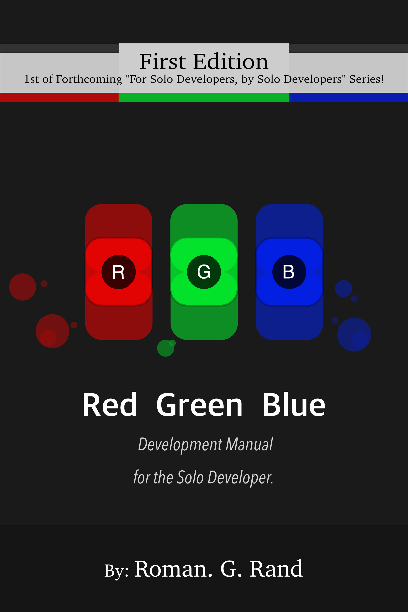

  

## Recent & About Me
Current standing:
**Red Green Blue** is a textbook that teaches systems design from the ground up. Currently it is in the early stages of development, but I have finished the reference edition as of February 14th 2026. (A true labor of love)
The reference edition is available for review below, and the rough draft of the Red Chapter (without exercises) will be the next thing available.
I plan to release the rough draft by the end of 2026, and the reference edition by the end of 2027. In good news, I have finalized the format of the book which will be Red, Green, Blue followed by a few select case studies.

Development changes?
**All roads lead to Google.** I had originally tried writing on the Reedsy platform, but it turns out Reedsy was really uncooperative with laying out images and font utilities. I have since moved to writing on Docs, where I have started writing the Red Chapter.
I have also started a platform for writers myself, and I plan to use it to publish the framework over the next few days at <a href="https://geniusdocs.blog">geniusdocs.blog</a>

## The Unabridged Behavioral Interview.
How I wish I could reply to "Tell us a little about yourself", and the expected maturity evident of a bureaucratic workplace  

Hi, I’m Roman.

I am an incoming Software Developer & IT Intern at Intact Financial and a Senior at Western Governors University. I tend to operate at a different speed than most—I recently completed 40 credits in 6 weeks, a pace fueled by a mix of obsessive study habits and a genuine love for the craft.

My journey in a nutshell:  
I first attended a coding bootcamp at 8 years old, and still have the Flappy Bird clone I built in Scratch.mit.edu on a flash drive to prove it!  
My Motivation: During a "Take Your Kid to Work Day" at Fannie Mae, a senior engineer saw my work and told me I belonged in the field. I’m still waiting for that specific job offer (call me, Fannie Mae!), but I’ve been building ever since. (it's okay, you can laugh)  
The Portfolio: Beyond the textbook, I’ve shipped Roblox games, three functional Unity templates, and various Discord utility bots (they keep me company)  
Life Accomplishments:  
- Former **Founder/ 2 year President** of Cosby HS Chess Club (peak 1900 LiChess)
- **4x Track and Field Captain, 4x State Men's Discus Top 10 (Freshman to Senior)**  
- **Alumni Executive** of Tau Kappa Epsilon (George Mason University chapter, elected as a freshman).  
- Completed a generational **40 credits in 6 weeks** at Western Governor's University, no public rankings, but this is **absolutely** not common.
- Survived Nuss (Two bars implanted into chest) surgery, Double Jaw surgery, and two car accidents (not my fault) in one year's time. (what can't this kid do?)

I am a high-output, determined individual. I guarantee this book will be ready for initial review by the end of 2026.

	Note to Reviewers: I am actively seeking feedback on the Reference Edition—specifically regarding subsection organization and technical fact-checking.

# Reference Edition - Definitions and planned structure
## Preface

Software Development and Systems Design is a discipline of efficiency and consistency. The colors Red, Green, and Blue represent the three topics that this textbook will cover: Failure, Scalability, and Speed.

### Red
Every connection to an app is a direct interaction with thousands of design decisions. Engineers must account for not only their own work, but the work that precedes them. Failures in any team are bound to happen, but it’s the readiness that separates the successful and the not-so. This portion covers how issues are prevented with proper testing and design principles.

### Green
In the Cloud-dominated world, scalability isn’t an issue. The worries of whether your application handles load are moot, it’s about the resources utilized to do so. This book will focus on ensuring elasticity for enterprise grade systems.

### Blue
You’re going to need speed. Delivering services faster and at lower compute than competitors is the core of most teams. From the interview to the job, your performance is measured by the real efficiency you create (or lag behind).
	While Artificial Intelligence can develop syntax and a convenient auto-complete, it cannot yet build a resilient system that incorporates a mastery of RGB. The incorporation of advanced design principles is critical for future engineers.

## Red

Red is the active prevention of technological armageddon.

### Verification & Validation (V&V)
When examining the V&V of a system’s components, you’re inspecting the liability. Every single line of code is a liability that must be verified whenever it is used. While Verification is the upward process of ensuring the technical requirements of any system are believed to be correct, Validation is the front-to-back testing of code to ensure that it meets the desired value to stakeholders.
This colliding relationship is often denoted by the V-Model, with these two processes representing a bridge between abstract requirements and concrete execution.

#### Verification
Verification begins with gathering fundamental requirements. After verifiable criteria is set, it is used in systems analysis, and ensures a proper software design that fits into a modular adoption.
This process is done both before and after code is written, whenever a criterion changes. Every new feature, and even fixes, are a liability that must be vetted.
(Describe every process, known issues, and resolve with the coding stage)

#### Validation
As the team begins producing viable code, the validation stage begins. The smallest units of the code are first tested individually, and larger tests incorporate the code into the module and systems level, afterward the system undergoes acceptance testing.
At any time that code is produced, and safely verified, it must finally be validated for this process to rest.

### ACID (Atomicity, Consistency, Isolation, Durability)
Define the all-or-nothing approach, and remember the divisibility structure of Atoms, Molecules, Organisms, Templates, Pages. Ensure state validation, operational independence of neighboring utilities, and permanent durable record keeping.å

### Guardrails
Implementing throttles which limit the resources of any user or process, as well as rate limiting total operations or requests. The circuit breaker pattern, partitioning system resources to ensure fails are contained, enforcing that data without adherence to strict typing is not allowed to exist.

### Observability
The property that enables current and future retrospective decisions, and ensures data telemetry.
Metric observation, logging event context, and tracing request paths.

### System Integrity
The final goal of the red phase is System Integrity, absolutely certain business logic, enforced atomicity, dynamic predictability, idempotency, and bulkheading.

### Accountability
The most important step in ensuring system integrity within the red phase is disaster management. Accountability, and workplace acceptance, of unforeseen issues is important to ensure that issues are resolved.

## Green

Green is the transition from the singular machine to the distributed system.

### The Cloud
Utilizing Infrastructure as a Service (IaaS), Platform as a Service (Paas), Function as a Service (Faas), Load Balancers, Object Storage, Managed Databases.

### Elasticity & Scalability
Scalability is the actual ability of a system to grow, whereas elasticity defines the compute required for some amount of growth or shrink. (describe models that describe elasticity, methods to reduce costs)

### Stateless vs. Stateful
The utilization of state for quicker access to data, but potential loss or inconsistency. Stateless allows for complete consistency across a distributed database and stateful, and discusses the importance of stateless in modern development as well as modern methods to improve speed that will be discussed in blue.

### Database Sharding and Partitioning
Partitioning involves separating a database into smaller fragments that are more manageable. It is important for any database that has expanded beyond its own physical limits to expand its data horizontally.

### Caching In
Using tools like Redis to undertake the bulk-heavy loads and reduce database pressure, inspect levels of caching from client, CDN, application, and distributed server (stateless access point).

## Blue

Blue is the iterative process of systems optimization.

### Latency & Throughput
Latency is the speed of a request and throughput is the capacity of the system in terms of operations(requests)/time.

### I/O Bottlenecks
Firstly, I/O Wait is when a CPU stall until it receives requested data from a file or database. Blocking and non-blocking I/O; when a process either continues working after sending a GET to another component or whether it stalls. Using I/O batching to minimize the total requests, pooling connections to prevent slowdowns from the handshake process on new queries, and ensuring that logs are written sequentially, which means in the same non-random location.

### Concurrency & Thread Management
Understanding the difference between concurrency and parallelism, wherein one system may interleave processes on it’s singular core (concurrency) or it might have multiple cores that work on these operations in parallel. A thread is the smallest unit of operations that a processor can handle. Creating, pausing, and terminating these threads is slow. Ensuring that threads are not exhausted on spikes, and that requests are assigned to a pool of open threads safely and switching between thread operations at a per processor level to ensure efficiency with variable resources. Race conditions occur when data is accessed and modified by multiple processes running asynchronously, which can result in corruption.

### Asynchronous Design
Instead of waiting, an asynchronous system operates on “firing and forgetting”. The system decouples the request from its response, not tracking the request handling directly and continuing onwards. Event-driven architecture uses Message Queues, where a Producer queues a move, a Responder confirms the operation will occur and immediately responds, and a Consumer that operates upon the queue in the background. Utilizes Optimistic UI that feels instant, and utilizes roll-backs on errors.

### Query Optimization
A honing process in which the logic where data is retrieved is optimized iteratively involving a few steps. Understanding the execution plan, the internal path that the database takes to find your data. General Database Indexing, N+1 query problem, denormalization for speed (contrast to red).

### Content Delivery Networks
Prevents geographic latency by physically moving user data closer to them. Understand the point of presence and the Time to First Byte with static data caching. Anycast routing and protocols, multiplexing, and edge code execution. CDN as a shield, and buffering spikes.
